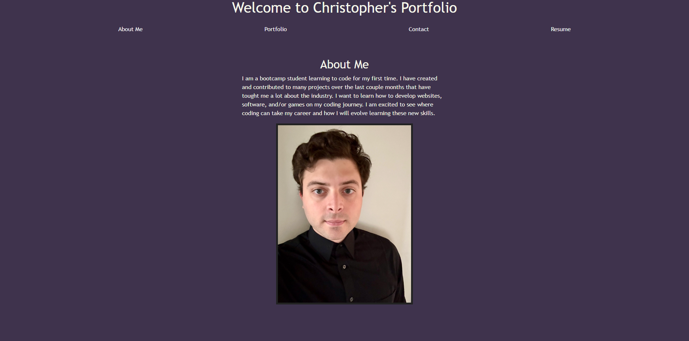

# React Portfolio
  
## Table of Contents
  * [Description](#description)
  * [Technology Used](#technology-used)
  * [Installation](#installation)
  * [Usage Information](#usage-information)
  * [License](#license)
  * [Contributing](#contributing)
  * [Tests](#tests)
  * [Questions](#questions)
  * [Github Profile](#github)
  * [E-mail](#email)
  
## Description 
A portfolio made using React and Vite. 
  
## Technology Used 
React, Vite, JavaScript, HTML, CSS, React Router Dom.
  
## Installation 
npm run build, npm run dev in the root directory will run the application.
  
## Usage Information 
When the user loads the page, they will be presented with an about me section. The user can then use the navigational links at the top to see my project, contact information, and resume.
  
## License 
### MIT
* 
* [Link to License Page](https://opensource.org/license/mit)
  
## Contributing 
### [milkytea6's Github Profile](https://github.com/milkytea6)

  
## Tests 
Preform tests on the application and report any bugs to the developer.
  
  
## Questions 
You can report any issues in the issues tab on Github. Or you can send any questions to the e-mail provided. 
Be clear with what repository you are referring to and as much detail as posible.
## Github Repository 
### [Link to React Protfolio Repository](https://github.com/Milkytea6/react-portfolio)
## E-mail 
chrisgcpg@gmail.com
### [React Portfolio Deployed on Netlify](https://66ba68b29028ae1340537324--earnest-salamander-246f2e.netlify.app/) 
### 